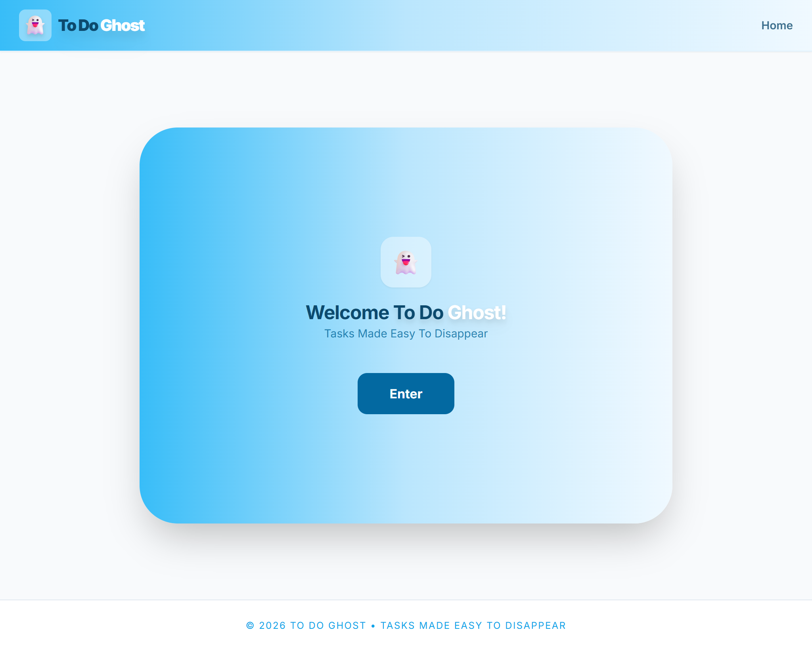
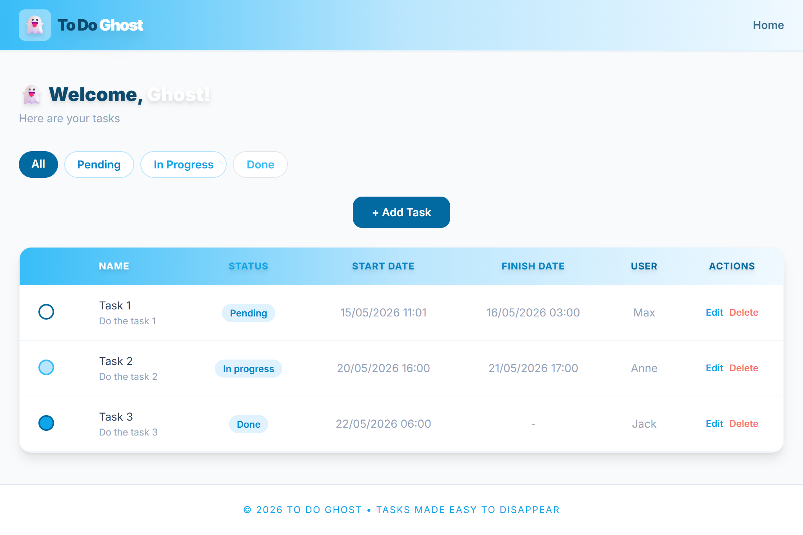
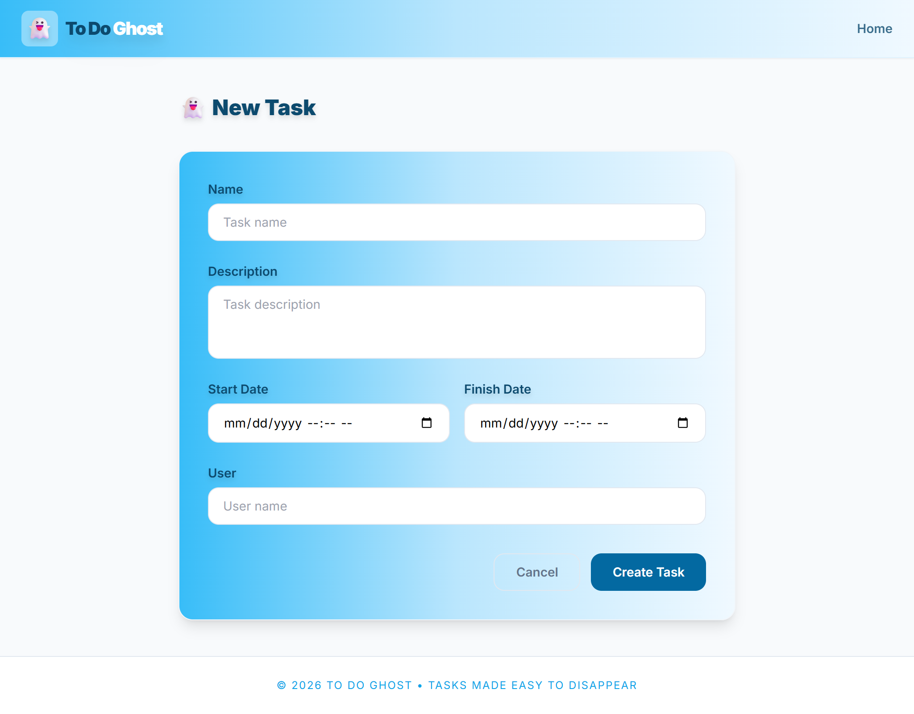
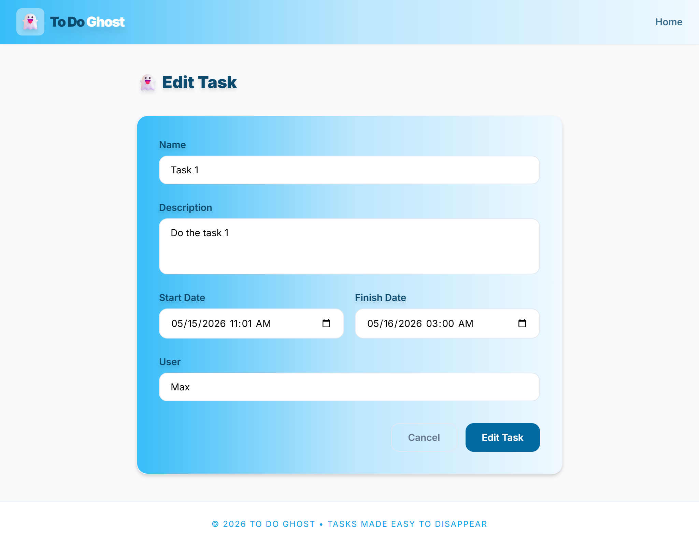

<p align="center">
  
</p>

<h1 align="center">To Do Ghost</h1>
<p align="center"><em>Tasks Made Easy To Disappear</em></p>

---

## 📄 Description

**To Do Ghost** is a task management web application built with PHP following the **MVC (Model-View-Controller)** architectural pattern.

The application allows users to create, list, update, and delete tasks, as well as track their status throughout the workflow — from pending to in progress to done.

This project was developed individually as part of Sprint 3, applying git flow methodology and MVC architecture with a custom PHP framework.

---

## 🎯 Features

* ➕ Create tasks with name, description, start date, finish date and user
* 📋 List all tasks in the dashboard
* 🔍 Filter tasks by status (Pending, In Progress, Done)
* ✏️ Edit existing tasks
* 🗑️ Delete tasks
* 🔘 Change task status directly from the dashboard
* 📱 Responsive design — table on desktop, cards on mobile

---

## 🛠 Technologies

* PHP 8.1+
* Tailwind CSS (via CDN)
* JSON (data storage)
* HTML5
* Git & GitHub (Git Flow)

---

## ⚙️ Requirements

* PHP 8.1 or higher
* Web server (Apache or PHP built-in server)

---

## 🚀 Installation

Clone the repository:

```bash
git clone https://github.com/M3lgone/task-s3-03-app-to-do.git
```

Navigate to the project:

```bash
cd task-s3-03-app-to-do
```

Start the PHP built-in server from the `web/` folder:

```bash
php -S localhost:8000 -t web/
```

Open your browser at:

```
http://localhost:8000
```

---

## 📁 Project Structure

```text
task-s3-03-app-to-do/
├── app/
│   ├── controllers/
│   │   ├── DashboardController.php
│   │   ├── HomeController.php
│   │   └── TaskController.php
│   ├── models/
│   │   ├── TaskModel.php
│   │   └── TaskStatus.php
│   └── views/
│       ├── layouts/
│       │   └── layout.phtml
│       └── scripts/
│           ├── dashboard/
│           │   └── index.phtml
│           ├── home/
│           │   └── index.phtml
│           └── task/
│               ├── create.phtml
│               └── edit.phtml
├── config/
│   └── routes.php
├── lib/
│   └── base/
│       ├── Controller.php
│       ├── Router.php
│       └── View.php
├── web/
│   ├── images/
│   └── index.php
├── .gitignore
└── README.md
```

---

## 🔄 MVC Flow

```
User → index.php → Router → Controller → Model (JSON) → Controller → View → User
```

* **Model** — reads and writes `tasks.json`
* **View** — renders HTML with the data provided
* **Controller** — handles HTTP requests and connects model and view

---

## 📸 Preview

### Home


### Dashboard


### Create Task


### Edit Task


---

## 🌿 Git Flow

This project follows the **Git Flow** branching strategy:

* `main` — production-ready code
* `develop` — integration branch
* `feature/*` — new features

---

## ✅ Use Cases

* [x] Create task
* [x] Update task
* [x] Delete task
* [x] List all tasks
* [x] Filter tasks by status
* [x] Change task status from dashboard

---
